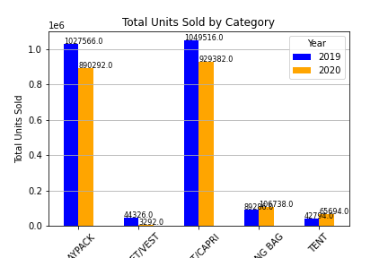
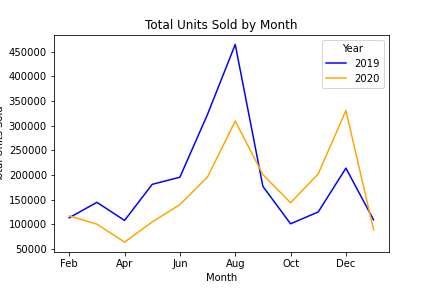

# Project 1 - Who wants to go camping during Covid-19?

### Project members:
Allen Virtusio, Carmela Monis, Julius Castro, Tina Ren, and Linda Stark

## Background

We wanted to see how Covid-19 played a difference in retail sales. We focused mainly on outdoor retail. During the initial process, it was hard to focus on which items we should include for our project. We had several ideas that ranged from RV sales to National Park attendance.

Since there was so much to choose from, we narrowed our parameters to timeframe, store types, apparel, camping gear, and other. We came up with this conclusion looking over several sets of data and decided we wanted to use the same data file. From there, we were able to generate our hypothesis:

Did Covid-19 have a significant growth impact on camping gear while hurting other retai categories?

## Data

Our data is from  https://www.npd.com/wps/portal/npd/us/news/insights/ .

From there we reviewed the csv file, looked at the information provided, factored out what we can analyze from this dataset, and how this data could be utilized to test if our hypothesis was correct or not.

Below is a sampling of the data we were able to analyze:

## Post Mortem

If we had more time with our project, we would've liked to have done a survey for the items we were analyzing. It would've been nice to pull National Park data and be able to look at more years to see if there is a cause/effect from Covid-19 timeframe. We could've utilized our api call to pull different places to go camping. 

I guess that's just a process for another day and time. Thank you for taking the time to review our ReadMe file.